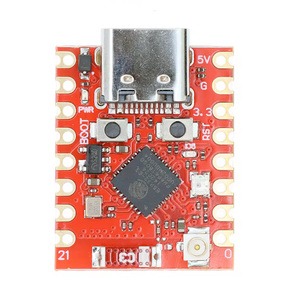
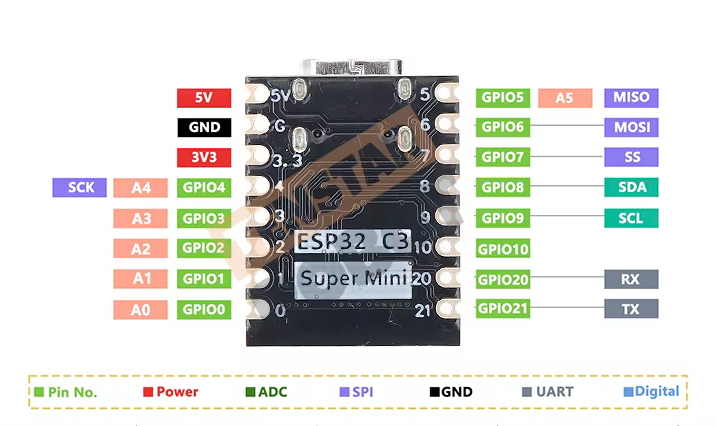

# Alternative Boards

TinkLink-USB is designed for the ESP32-S3 with USB Host, but it also runs on boards without USB Host by using UART serial to communicate with the RetroTINK 4K.

## ESP32-C3 Super Mini Plus



The [ESP32-C3 Super Mini Plus](https://www.espboards.dev/esp32/esp32-c3-super-mini-plus/) is a compact, low-cost board with WiFi, two hardware UARTs, and an onboard WS2812 RGB LED. It cannot use USB Host, so it communicates with the RetroTINK 4K over UART serial instead.

**Specs:** ESP32-C3 RISC-V @ 160MHz, 4MB flash, 400KB SRAM, WiFi 802.11 b/g/n, BLE 5.0

### Trade-offs vs ESP32-S3

| | ESP32-S3 (USB Host) | ESP32-C3 (UART) |
|---|---|---|
| RT4K connection | USB cable (power + data) | UART wiring (TX/RX + level shifter) |
| RT4K power detection | Automatic via USB serial messages | May work over UART; use `powerManagementMode` setting if not |
| Components needed | USB OTG cable | Additional RS-232 level shifter for RT4K |
| Board cost | ~$5-8 | ~$3-5 |

### Wiring

The C3 uses both hardware UARTs — one for the video switcher, one for the RetroTINK:



| Function | UART | GPIO | Baud |
|----------|------|------|------|
| Switcher TX | UART0 | 21 | 9600 |
| Switcher RX | UART0 | 20 | 9600 |
| RetroTINK TX | UART1 | 0 | 115200 |
| RetroTINK RX | UART1 | 1 | 115200 |
| Status LED | — | 8 | — |

Both the switcher and RetroTINK connections require RS-232 level shifters (MAX3232 or similar) between the ESP32-C3's 3.3V GPIOs and the RS-232 voltage levels on the devices.

### Configuration

The C3 uses a separate filesystem image (`data_c3/`) with board-specific defaults. Review these files before building:

**`data_c3/wifi.json`** — Set your WiFi credentials:
```json
{
    "ssid": "YourNetwork",
    "password": "YourPassword"
}
```

**`data_c3/config.json`** — Default pin assignments and settings:
```json
{
    "switcher": {
        "type": "Extron SW VGA",
        "uartId": 0,
        "txPin": 21,
        "rxPin": 20,
        "autoSwitch": true
    },
    "tink": {
        "serialMode": "uart",
        "powerManagementMode": "full",
        "uartId": 1,
        "txPin": 0,
        "rxPin": 1
    },
    "hardware": {
        "ledPin": 8,
        "ledColorOrder": "GRB"
    }
}
```

Adjust pin numbers if your wiring differs. Edit `triggers` to match your switcher inputs and RT4K profiles. See [Configuration Reference](CONFIGURATION.md) for detailed descriptions of all settings.

#### Power Management Modes

The `powerManagementMode` setting controls how TinkLink handles RT4K power state. This matters because UART serial may or may not receive the RT4K's boot/sleep status messages:

| Mode | Behavior | Use when |
|------|----------|----------|
| `full` | Tracks power state via serial messages. Auto-wakes RT4K from sleep. | Status messages are received (try this first) |
| `simple` | Sends `pwr on` once on first input change, waits 15 seconds, then sends all commands immediately. | Status messages are not received and RT4K may be off at startup |
| `off` | Sends commands immediately with no power management. | RT4K is always on |

Start with `full`. If your RT4K doesn't respond to input changes after sleep/wake cycles, switch to `simple`.

### Build and Upload

**Prerequisites:** [PlatformIO CLI](https://platformio.org/install/cli) or PlatformIO IDE, USB-C cable.

```bash
# Build firmware
pio run -e esp32c3

# Upload firmware via USB
pio run -t upload -e esp32c3

# Upload filesystem (config + web interface) via USB
pio run -t uploadfs -e esp32c3
```

If the upload fails to connect, enter bootloader mode: hold **BOOT**, press **RESET**, release **BOOT**, then retry.

### Verify

After upload, the LED cycles through Red, Green, Blue, Yellow during startup, then shows WiFi status:
- **Blue blinking** — Access Point mode (first boot)
- **Green solid** — Connected to WiFi
- **Red solid** — Connection failed

Access the web interface at `http://tinklink.local`. Once connected to WiFi, subsequent updates can use OTA:

```bash
pio run -t ota -e esp32c3
pio run -t otafs -e esp32c3
```

### References

- [Configuration Reference](CONFIGURATION.md) — Complete guide to all config.json and wifi.json settings
- [ESP32-C3 Super Mini Plus — ESPBoards.dev](https://www.espboards.dev/esp32/esp32-c3-super-mini-plus/)
- [ESP32-C3 Datasheet](https://www.espressif.com/sites/default/files/documentation/esp32-c3_datasheet_en.pdf)
