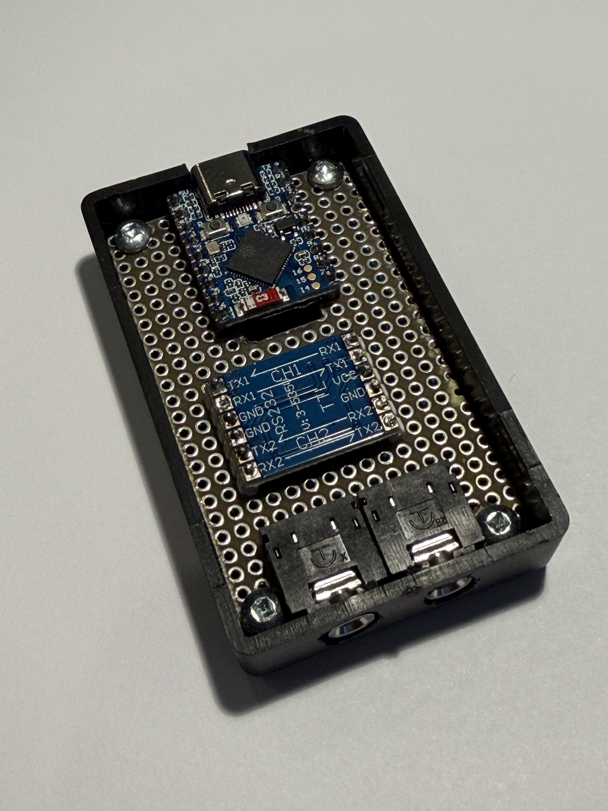
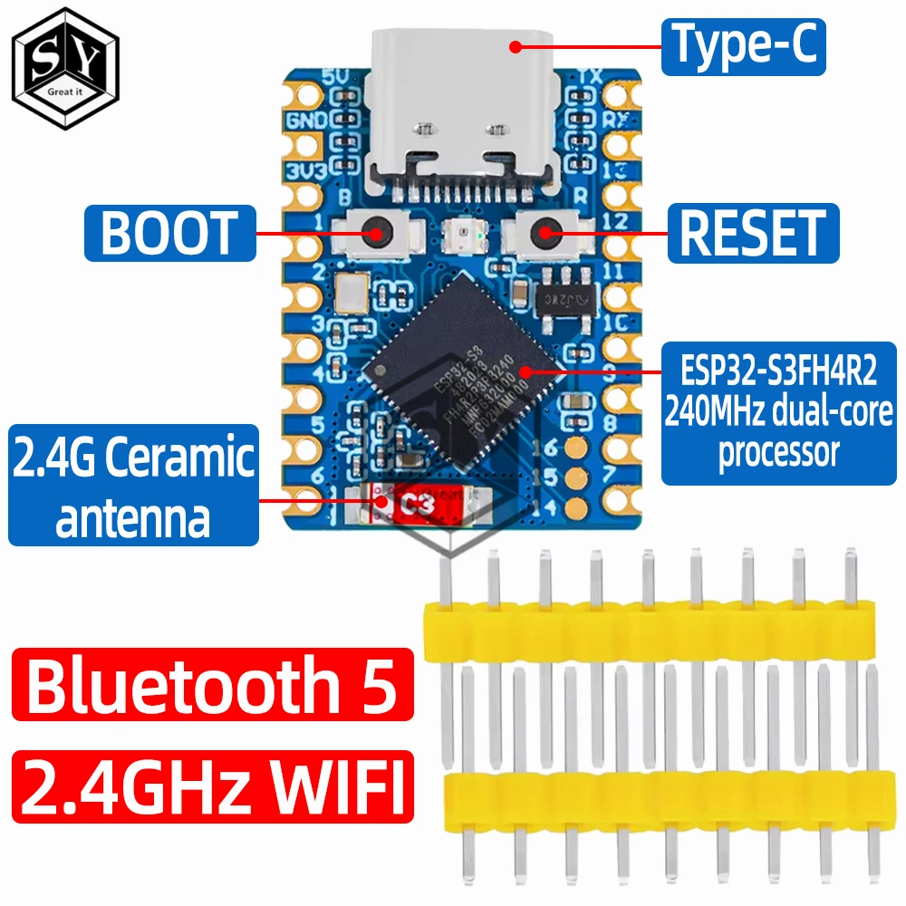
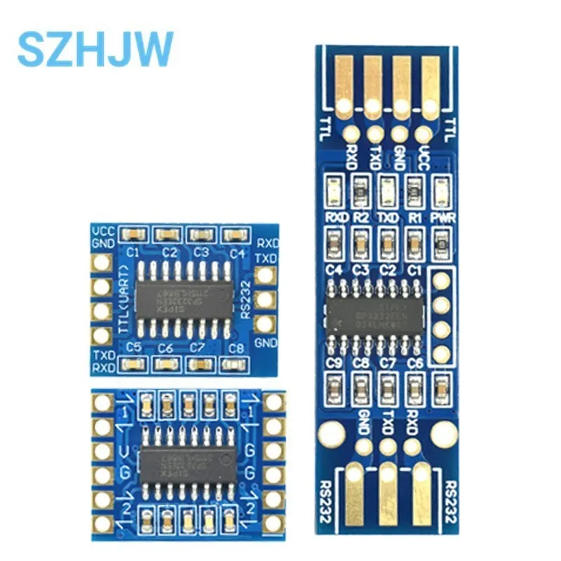
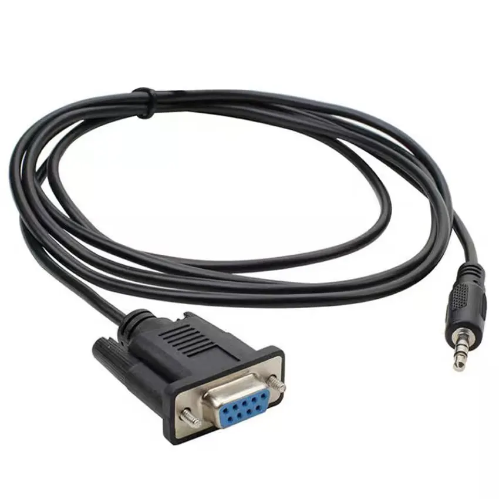

# TinkLink-USB

> **Current Version**: 1.9.2

An ESP32-based bridge between video switchers and the RetroTINK 4K.

TinkLink-USB automatically triggers RetroTINK 4K profile changes when your video switcher changes inputs. It communicates with the RetroTINK 4K over **USB Host** (ESP32-S3) or **UART serial** ([alternative boards](ALTERNATIVE_BOARDS.md)), and monitors your video switcher over RS-232.



## Why USB Instead of UART?

The original [TinkLink](https://github.com/Patrick-Working/tink-link) project used the RetroTINK's HD-15 (VGA) serial pins, which required:
- Custom VGA cable adapter to access serial pins
- RS-232 level shifter (MAX3232)
- Careful wiring to avoid interfering with VGA video signal

**TinkLink-USB simplifies this** by connecting directly to the RetroTINK's USB-C port:
- ✅ Single USB OTG cable provides both power and communication
- ✅ No custom adapters or level shifters needed
- ✅ RetroTINK's USB serial uses FTDI FT232R chip (standard USB-to-serial)
- ✅ Native 115200 baud communication (RetroTINK's native speed)

## Features

- **USB Host Communication** - Direct USB serial connection to RetroTINK 4K via FTDI FT232R
- **RT4K Power State Tracking** - Detects boot complete and power-off events via serial, auto-wakes RT4K when input changes arrive while sleeping
- **Signal Detection Auto-Switch** - Parses Extron signal detection messages (`Sig`) to automatically switch inputs when a video source is powered on, with 2-second debounce to filter glitches
- **SVS & Remote Commands** - Supports both SVS (Scalable Video Switch) and Remote profile loading modes with automatic keep-alive
- **Denon/Marantz AVR Control** - Automatic power-on and input switching via telnet (TCP port 23) when video switcher input changes
- **AVR Network Discovery** - SSDP (UPnP) multicast discovery finds Denon/Marantz AVRs on the local network with model identification
- **Video Switcher Support** - Monitors Extron SW series VGA switchers via RS-232 (modular design supports future switcher types)
- **Web Interface** - Monitor status, configure WiFi, manage input triggers, and configure AVR settings from any browser
- **Trigger Configuration** - Web-based interface to create and edit switcher input to RetroTINK profile mappings
- **System Console** - Web-based debug console with live log streaming and command sending to switcher, RetroTINK, or AVR
- **OTA Updates** - Update firmware and filesystem over WiFi (no USB required)
- **Centralized Logging** - Debug logs with timestamps accessible via web interface and `scripts/logs.py`
- **WiFi Resilience** - Automatic retry with exponential backoff, AP fallback with periodic reconnection to saved network, and proper DHCP hostname registration
- **mDNS Support** - Access via `http://tinklink.local`
- **Persistent Configuration** - Settings stored in flash via LittleFS

## Hardware Requirements

### Required Components

| Component | Notes |
|-----------|-------|
| **ESP32-S3 Dev Board** | USB Host requires ESP32-S3 (S3-DevKitC, ATOMS3, or StampS3). See [Alternative Boards](ALTERNATIVE_BOARDS.md) for non-S3 options. |
| **USB OTG Cable** | Type-C to Type-A with power support (18W+ recommended) |
| **RetroTINK 4K** | USB serial interface enabled |
| **Extron SW VGA** | Or compatible video switcher with RS-232 output |
| **RS-232 Level Shifter** | MAX3232 or similar (for Extron connection only) |

### ESP32-S3 Boards

Supported boards (based on [EspUsbHost](https://github.com/wakwak-koba/EspUsbHost) library):

| Board | Notes |
|-------|-------|
| **Waveshare ESP32-S3-Zero** | ✅ **Recommended** - Compact (23.5×18mm), USB-C port, castellated holes. [Pinout](https://www.espboards.dev/esp32/esp32-s3-zero/) • [Wiki](https://www.waveshare.com/wiki/ESP32-S3-Zero) |
| **ESP32-S3-DevKitC-1** | Standard development board, readily available |
| **M5Stack ATOMS3** | Compact form factor with built-in display |
| **M5Stack StampS3** | Ultra-compact module |

#### Waveshare ESP32-S3-Zero Details

The **Waveshare ESP32-S3-Zero** is highly suitable for this project:

**Specifications:**
- **Chip**: ESP32-S3FH4R2 dual-core @ 240MHz
- **Memory**: 4MB Flash, 2MB PSRAM, 512KB SRAM
- **Size**: 23.5 × 18mm (ultra-compact)
- **GPIO**: 24 available pins (GPIO33-37 reserved for PSRAM)
- **USB**: Native USB on GPIO19 (D-) and GPIO20 (D+)
- **LED**: WS2812B RGB LED on GPIO21
- **UART0**: Dedicated TX on GPIO43, RX on GPIO44 (accessible on edge connectors)
- **Power**: 3.7V-6V, minimum 500mA @ 5V
- **WiFi**: 2.4GHz 802.11 b/g/n
- **Bluetooth**: BLE 5.0

**Pin Assignments for TinkLink-USB:**
- **GPIO21**: WS2812 RGB LED (status indicator)
- **GPIO43**: UART0 TX (Extron switcher communication, 9600 baud)
- **GPIO44**: UART0 RX (Extron switcher communication)
- **GPIO19/20**: USB OTG (RetroTINK communication)

**USB Host Configuration:**

The ESP32-S3 has two USB controllers sharing GPIO19/GPIO20:
1. **USB Serial/JTAG** - Default mode for programming and debugging
2. **USB OTG** - For USB Host/Device functionality

To use USB Host mode, the platformio.ini must configure USB OTG mode:
```ini
build_flags =
    -DARDUINO_USB_MODE=0    ; 0 = OTG mode, 1 = CDC mode (default)
```

**Trade-offs:**
- ✅ USB OTG mode enables USB Host functionality for RetroTINK communication
- ⚠️ Disables USB CDC serial debugging (use web console or `scripts/logs.py` instead)
- ⚠️ Programming requires OTA updates or manually entering bootloader mode

**References:**
- [Waveshare ESP32-S3-Zero Wiki](https://www.waveshare.com/wiki/ESP32-S3-Zero)
- [ESPBoards.dev - ESP32-S3-Zero](https://www.espboards.dev/esp32/esp32-s3-zero/)
- [Schematic PDF](https://files.waveshare.com/wiki/ESP32-S3-Zero/ESP32-S3-Zero-Sch.pdf)
- [ESP32-S3 USB OTG Documentation](https://docs.espressif.com/projects/esp-idf/en/stable/esp32s3/api-guides/usb-otg-console.html)

### Pin Assignments

#### Waveshare ESP32-S3-Zero

| Function | GPIO | Notes |
|----------|------|-------|
| USB Host D+ | 20 | Connected to Type-C port (USB OTG mode) |
| USB Host D- | 19 | Connected to Type-C port (USB OTG mode) |
| Extron TX | 43 | Hardware UART0 TX, 9600 baud |
| Extron RX | 44 | Hardware UART0 RX |
| Status LED | 21 | WS2812B RGB LED (onboard) |

**Important Notes:**
- GPIO19/20 are internally connected to the board's Type-C USB port
- USB OTG mode disables USB CDC debugging - use web console for debugging instead
- GPIO33-37 are reserved for onboard PSRAM and not available
- The Type-C port serves dual purpose: programming (Serial/JTAG mode) and USB Host (OTG mode)
- UART0 (GPIO43/44) is used for Extron communication at 9600 baud

### Wiring Connections

**RetroTINK 4K (via USB):**
- Connect ESP32-S3 USB OTG port to RetroTINK USB-C port
- Use USB OTG cable with power support
- RetroTINK appears as FTDI FT232R device (`/dev/ttyUSB0` on Linux)
- Serial settings: 115200 baud, 8N1

**Extron SW VGA (via RS-232):**
- Requires RS-232 level shifter (3.3V ↔ RS-232 voltage levels)
- ESP32 TX → Level Shifter → Extron RX
- Extron TX → Level Shifter → ESP32 RX
- Common RS-232 level shifter: MAX3232
- Serial settings: 9600 baud, 8N1

## RetroTINK 4K Serial Protocol

The RetroTINK 4K supports two command types over USB serial:

### Remote Commands

Emulate IR remote button presses:
```
remote prof1\r\n    # Load Profile 1
remote prof2\r\n    # Load Profile 2
remote menu\r\n     # Open menu
```

### SVS Commands

Scalable Video Switch protocol for automated profile loading:
```
SVS NEW INPUT=1\r\n    # Switch to input 1 and load S1_*.rt4 profile
SVS NEW INPUT=2\r\n    # Switch to input 2 and load S2_*.rt4 profile
```

**Serial Settings:**
- Baud Rate: 115200
- Data Format: 8N1 (8 data bits, no parity, 1 stop bit)

**Reference**: [RetroTINK-4K Wiki - Serial Communication](https://consolemods.org/wiki/AV:RetroTINK-4K#Serial_Over_USB_/_HD-15)

## Getting Started

### Prerequisites

1. **PlatformIO** - Install one of:
   - [VS Code](https://code.visualstudio.com/) with [PlatformIO IDE extension](https://platformio.org/install/ide?install=vscode) (recommended)
   - [PlatformIO Core CLI](https://platformio.org/install/cli)

2. **ESP32-S3 Development Board**
   - **Recommended**: [Waveshare ESP32-S3-Zero](https://www.aliexpress.com/item/1005006963045909.html) (compact, castellated holes, onboard RGB LED)
   - Alternatives: ESP32-S3-DevKitC-1, M5Stack ATOMS3, or M5Stack StampS3

   

3. **RS-232 to TTL Module** - For Extron switcher connection
   - [MAX3232 TTL to RS232 Converter Module](https://www.aliexpress.com/item/1005006210630153.html)
   - Converts between RS-232 voltage levels and ESP32 3.3V UART

   

4. **DB9 Serial Adapter** - For connecting to Extron serial port
   - [DB9 to 3.5mm Stereo Adapter](https://www.aliexpress.com/item/1005009105067080.html)
   - Connects TinkLink USB to Extron's DB9 serial port

   

5. **USB OTG Cable** - For connecting ESP32-S3 to RetroTINK 4K
   - [MOGOOD 60W PD USB OTG adapter](https://www.amazon.ca/dp/B0B5MPCJF5)
   - Also requires a USB A to USB C adapter cable to connect the TinkLink-USB to the USB A port

6. **2.4GHz WiFi network** - For web interface access

### Installation

The device runs in USB OTG mode for USB Host communication with the RetroTINK 4K.

#### Step 1: Clone the Repository

```bash
git clone https://github.com/smudgeface/tink-link-usb.git
cd tink-link-usb
```

#### Step 2: Connect Hardware

Connect your **Waveshare ESP32-S3-Zero** to your computer via USB-C cable.

#### Step 3: Build the Firmware

Compile the project to verify everything is set up correctly:

```bash
pio run -e esp32s3
```

This compiles the firmware but does not upload it to the device.

#### Step 4: Upload Firmware

Flash the compiled firmware to the ESP32-S3:

```bash
pio run -e esp32s3 -t upload
```

The device will automatically reset after upload.

**Note**: The firmware runs in USB OTG mode (USB Host for RetroTINK communication). USB CDC is disabled, so USB uploads require manually entering bootloader mode, or using OTA updates instead. To enter bootloader mode:
1. Hold the **BOOT** button
2. Press and release **RESET** (or unplug/replug USB)
3. Release **BOOT** - device is now waiting for upload
4. Run `pio run -t upload` within a few seconds

OTA updates are recommended once the device has WiFi configured, as they don't require physical button access.

#### Step 5: Upload Filesystem

Upload the web interface files (HTML, CSS, config files) to the device's LittleFS filesystem:

```bash
pio run -e esp32s3 -t uploadfs
```

**Important**: You must run this command to access the web interface. Without it, you'll see "Not Found" errors when browsing to the device.

See [Configuration Reference](CONFIGURATION.md) for details on all settings in `config.json` and `wifi.json`.

#### Step 6: Monitor Serial Output (Optional)

To view debug output and verify the device is working:

```bash
pio device monitor -e esp32s3
```

Press `Ctrl+C` to exit the monitor.

#### Step 7: Configure WiFi (Optional)

On first boot, the device starts in Access Point (AP) mode:

1. Look for the **blue blinking LED** on the ESP32-S3-Zero
2. Connect to the WiFi network named **`TinkLink-XXXXXX`** (no password)
3. Your device should auto-assign an IP via DHCP (192.168.1.100-200 range)
4. Open a web browser and navigate to **`http://tinklink.local`** or **`http://192.168.1.1`**
5. Use the web interface to scan for networks and connect to your 2.4GHz WiFi

**Note:** You can leave the device permanently in AP mode if you prefer. This is useful if:
- You don't want TinkLink on your home network
- You only need occasional access for status checks or configuration
- Your setup location doesn't have WiFi coverage

#### Step 8: Access Web Interface

**In AP Mode** (blue blinking LED):
- Connect to the `TinkLink-XXXXXX` WiFi network
- Access at **`http://tinklink.local`** or **`http://192.168.1.1`**

**In Station Mode** (green solid LED):
- Access at **`http://tinklink.local`** (via mDNS)
- Or use the IP address assigned by your router

### Complete Build & Upload Commands

For convenience, here's the complete sequence to build and flash everything:

```bash
# Build, upload firmware, and upload filesystem in one go
pio run -e esp32s3 -t upload && pio run -e esp32s3 -t uploadfs
```

**Note**: The firmware runs in USB OTG mode. After the first USB upload, subsequent updates should use OTA.

### OTA (Over-The-Air) Updates

Once your device is connected to WiFi, you can update firmware and filesystem without USB:

**Via Web Interface:**
1. Navigate to `http://tinklink.local` → Debug page
2. Scroll to "Firmware Update (OTA)" section
3. Select firmware (`.bin`) or filesystem (`.bin`) file
4. Click Upload and wait for completion
5. Device will automatically reboot

**Via Command Line (PlatformIO):**
```bash
# Build and upload firmware via OTA
pio run -t ota -e esp32s3

# Build and upload filesystem via OTA
pio run -t otafs -e esp32s3

# Use a specific IP address instead of mDNS
TINKLINK_HOST=192.168.1.100 pio run -t ota -e esp32s3
```

**Via Python Script (standalone):**
```bash
python scripts/ota_upload.py firmware .pio/build/esp32s3/firmware.bin
python scripts/ota_upload.py fs .pio/build/esp32s3/littlefs.bin
python scripts/ota_upload.py firmware firmware.bin --host 192.168.1.100
```

**Environment Variable (optional):**
- `TINKLINK_HOST` - Override device hostname/IP (default: `tinklink.local`). Useful if mDNS isn't working on your network or you prefer using a static IP. PlatformIO custom targets don't accept command-line arguments, so this env variable is the only way to specify a different host.

### Remote Log Monitoring

When USB CDC is disabled (USB OTG mode for USB Host), you can monitor device logs remotely via the HTTP API using the `scripts/logs.py` utility:

```bash
# Tail logs continuously (Ctrl+C to stop)
python scripts/logs.py

# Show 50 most recent log entries
python scripts/logs.py -n 50

# Clear the log buffer
python scripts/logs.py --clear

# Use a specific IP address
python scripts/logs.py --host 192.168.1.100

# Or use environment variable
TINKLINK_HOST=192.168.1.100 python scripts/logs.py
```

**Features:**
- Color-coded output by log level (gray=DEBUG, default=INFO, yellow=WARN, red=ERROR)
- Continuous tailing with 1-second polling interval
- Timestamps in seconds since device boot
- Same `TINKLINK_HOST` environment variable as OTA scripts

Logs can also be viewed in the web interface at `http://tinklink.local` → Debug page.

### Web Interface

The web interface provides comprehensive configuration and monitoring capabilities:

**Status Page** (`/`)
- WiFi connection status and network information
- Switcher status (type and current input)
- RetroTINK USB connection status, power state, and last command
- Configured input triggers

**Config Page** (`/config.html`)
- WiFi network scanning and connection management
- AVR receiver configuration:
  - Enable/disable Denon/Marantz AVR control
  - SSDP network discovery to find AVRs automatically
  - Configure IP address and input source
  - Test connection
- Trigger configuration:
  - View all switcher input to RetroTINK profile mappings
  - Add new triggers (input, profile, mode, name)
  - Edit existing triggers
  - Delete triggers
  - Live save to device flash

**Debug Page** (`/debug.html`)
- System console with live log updates and timestamps
- Send commands to switcher or RetroTINK
- LED color testing
- OTA firmware and filesystem updates

**API Documentation** (`/api.html`)
- Complete REST API reference
- Request/response examples
- Interactive "Try" buttons for GET endpoints

## Troubleshooting

### Device Won't Boot / Boot Loop

**Symptom**: Device continuously reboots with error: `E (xxx) spi_flash: Detected size(4096k) smaller than the size in the binary image header(8192k)`

**Solution**: This occurs when the firmware is built for 8MB flash but your device has 4MB. The `platformio.ini` file must include:

```ini
board_upload.flash_size = 4MB
board_build.flash_size = 4MB
```

These settings are already configured correctly in this project. If you still see this error:

1. Clean the build cache: `pio run -e esp32s3 -t clean`
2. Erase flash completely: `python3 ~/.platformio/packages/tool-esptoolpy/esptool.py --chip esp32s3 --port /dev/cu.usbmodem1101 erase_flash`
3. Rebuild and upload: `pio run -e esp32s3 -t upload`

### Web Interface Shows "Not Found"

**Symptom**: Web server responds but all pages show "Not Found"

**Solution**: The filesystem hasn't been uploaded. Run:

```bash
pio run -e esp32s3 -t uploadfs
```

This uploads the HTML, CSS, and config files to the device's LittleFS filesystem.

### LED Color Reference

- **Blue blinking** (500ms) = Access Point mode active
- **Yellow solid** = Connecting to WiFi
- **Green solid** = Connected to WiFi network
- **Red solid** = Connection failed
- **Off** = Disconnected or initializing

### mDNS Not Working

**Symptom**: Cannot access `http://tinklink.local`

**Solution**:
- **macOS/Linux**: mDNS should work automatically
- **Windows**: Install [Bonjour Print Services](https://support.apple.com/kb/DL999) or use the device's IP address instead
- **Alternative**: Check your router's DHCP client list for the device's IP address

### Serial Monitor Not Working

If `pio device monitor` fails with a termios error, the serial port may be in use. Try:
- Unplug and replug the USB cable
- Use a different serial terminal like `screen` or `minicom`
- Check that no other application is using the serial port

## Project Structure

```
tink-link-usb/
├── README.md
├── ALTERNATIVE_BOARDS.md      # Guide for ESP32-C3 and other boards
├── CLAUDE.md                  # AI assistant development guide
├── CONFIGURATION.md           # Configuration reference for all settings
├── platformio.ini
├── assets/
│   ├── docs/                  # Reference documentation
│   └── hardware/              # Hardware photos and pinout diagrams
├── scripts/
│   ├── ota_upload.py          # OTA firmware/filesystem upload
│   ├── logs.py                # Remote log monitoring
│   └── c3_data_dir.py         # PlatformIO pre-script for ESP32-C3
├── src/
│   ├── main.cpp               # Application entry point
│   ├── version.h              # Semantic version defines
│   ├── SerialInterface.h      # Abstract serial interface
│   ├── UsbHostSerial.*        # USB Host FTDI serial driver (S3 only)
│   ├── UartSerial.*           # Hardware UART serial driver
│   ├── TelnetSerial.*         # TCP telnet serial transport
│   ├── Switcher.h             # Abstract video switcher interface
│   ├── SwitcherFactory.*      # Creates switcher by type string
│   ├── ExtronSwVgaSwitcher.*  # Extron SW VGA switcher implementation
│   ├── RetroTink.*            # RetroTINK 4K controller
│   ├── DenonAvr.*             # Denon/Marantz AVR controller
│   ├── WifiManager.*          # WiFi STA/AP management
│   ├── WebServer.*            # Async web server and API
│   ├── ConfigManager.*        # LittleFS configuration
│   └── Logger.*               # Centralized logging system
├── data/                      # Web interface + config (ESP32-S3)
└── data_c3/                   # Web interface + config (ESP32-C3)
```

## Changelog

### v1.9.2 — WiFi Resilience & DHCP Hostname

- **AP mode reconnection** — When the device falls back to Access Point mode after losing WiFi, it now periodically attempts to reconnect to the saved network (every 30 seconds) using AP+STA mode. The AP remains accessible during reconnection attempts so the web UI is always reachable. On successful reconnection, the device transitions back to STA-only mode.
- **DHCP hostname registration** — The device now properly registers its hostname (`tinklink`) with the router's DHCP server. Requires `WiFi.config()` before `WiFi.setHostname()` on ESP32 Arduino to ensure the hostname is included in DHCP requests. Hostname is re-set after every `WiFi.mode()` change to prevent the ESP32 from reverting to the default name.
- **Disabled ESP32 auto-reconnect** — `WiFi.setAutoReconnect()` is now disabled. The ESP32's built-in auto-reconnect silently reconnects with the default hostname (`esp32s3-XXXX`), bypassing the application's hostname configuration. All reconnection is now handled by WifiManager's state machine, which properly configures the hostname before each connection attempt.
- **Hostname in status API** — `GET /api/status` now includes `wifi.hostname` field showing the current DHCP hostname for diagnostics.

### v1.9.0 — Pluggable Switcher Architecture, ESP32-C3 Support & Power Management

- **Pluggable switcher architecture** — Abstract `Switcher` base class with `SwitcherFactory`; renamed `ExtronSwVga` → `ExtronSwVgaSwitcher`; all Extron-specific naming generalized throughout codebase
- **Serial transport refactoring** — New `UartSerial` class wrapping `HardwareSerial` with configurable UART number, TX/RX pins, and baud rate; each device class now owns its serial transport internally
- **ConfigManager refactoring** — Replaced typed config structs with raw `JsonDocument` storage; new accessors (`getSwitcherType()`, `getSwitcherConfig()`, `getAvrConfig()`, `getRetroTinkConfig()`); new `"tink"` config section for RetroTINK serial and power settings
- **RetroTINK power management** — Configurable `serialMode` (`"usb"` or `"uart"`) and `powerManagementMode` with three modes: `"off"` (commands sent immediately), `"simple"` (sends `pwr on` once then waits for boot), `"full"` (complete power state tracking via serial status messages)
- **ESP32-C3 support** — New `[env:esp32c3]` PlatformIO environment; `NO_USB_HOST` build flag excludes USB Host code; separate `data_c3/` filesystem directory with C3-specific pin and UART config; pre-build script overrides data directory per environment
- **LED configuration** — New `ledColorOrder` config field (`"RGB"` or `"GRB"`); runtime color order selection; added GPIO8 support for C3 boards
- **Documentation** — New [ALTERNATIVE_BOARDS.md](ALTERNATIVE_BOARDS.md) guide covering ESP32-C3 Super Mini Plus wiring, configuration, and build instructions

### v1.8.0 — AVR Network Discovery

- **SSDP Discovery** — "Discover" button on config page finds Denon/Marantz AVRs on the local network via UPnP multicast, fetches friendly names from device XML descriptions
- **New API endpoint** — `GET /api/avr/discover` with polling pattern (matches WiFi scan UX)
- **Reference docs** — Added [HEOS CLI Protocol Specification](assets/docs/HEOS_CLI_Protocol_Specification.pdf) to `assets/docs/`

### v1.7.0 — Denon/Marantz AVR Control

- **AVR telnet control** — Sends power-on (`PWON`) and input select (`SI<input>`) commands via TCP port 23 when video switcher input changes
- **Modular serial transport** — `SerialInterface` abstraction with `TelnetSerial` implementation for TCP-based serial communication
- **AVR configuration UI** — Config page section for enabling AVR control, setting IP address, selecting input source, and testing the connection
- **AVR status API** — `GET /api/config/avr`, `POST /api/config/avr`, `POST /api/avr/send` endpoints
- **Denon protocol** — ASCII commands terminated with CR; supports power, input, and volume queries

### v1.6.0 — Signal Detection Auto-Switch

- **Extron signal parsing** — Parses `Sig` messages from Extron switcher to detect video source power-on/off events
- **Auto-switch with debounce** — 2-second debounce filters signal glitches; highest active input wins
- **Signal restore handling** — Re-triggers input callback when signal returns on current input (enables RT4K auto-wake after power cycle)

### v1.5.0 — USB Host Communication

- **USB Host FTDI driver** — `UsbHostSerial` class communicates with RetroTINK 4K via FTDI FT232R at 115200 baud
- **RT4K power state tracking** — Detects boot complete, power-off, and sleep events via serial
- **Auto-wake** — Automatically powers on RT4K and queues commands when input changes arrive while sleeping
- **SVS keep-alive** — Sends follow-up `SVS CURRENT` command after `SVS NEW` to maintain connection
- **USB OTG mode** — Switched from CDC to OTG mode; all debugging via web console and `scripts/logs.py`

## Reference Projects

- **[ClownCar](https://github.com/svirant/ClownCar)** - Arduino Nano ESP32 project that uses USB Host to communicate with RetroTINK 4K
- **[EspUsbHost](https://github.com/wakwak-koba/EspUsbHost)** - ESP32-S3 USB Host library supporting FTDI serial devices
- **[HEOS CLI Protocol Specification](assets/docs/HEOS_CLI_Protocol_Specification.pdf)** - Denon/Marantz network protocol (SSDP discovery, telnet control)
- **[Denon AVR Network Ports](https://manuals.denon.com/EUsecurity/EU/EN/index.php)** - Required firewall ports for AVR network control

## License

MIT License - see [LICENSE](LICENSE) for details.

## Credits

Based on the [TinkLink-Lite](https://github.com/smudgeface/tink-link-lite) project, which was itself based on the original [tink-link](https://github.com/smudgeface/tink-link) MicroPython project.
