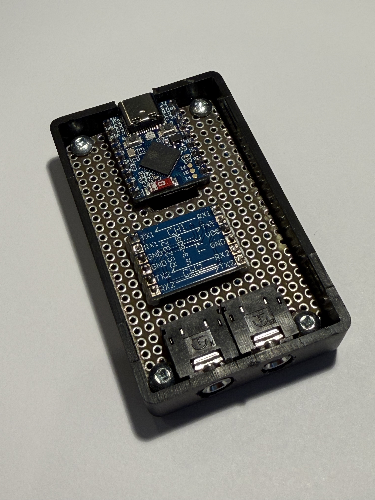
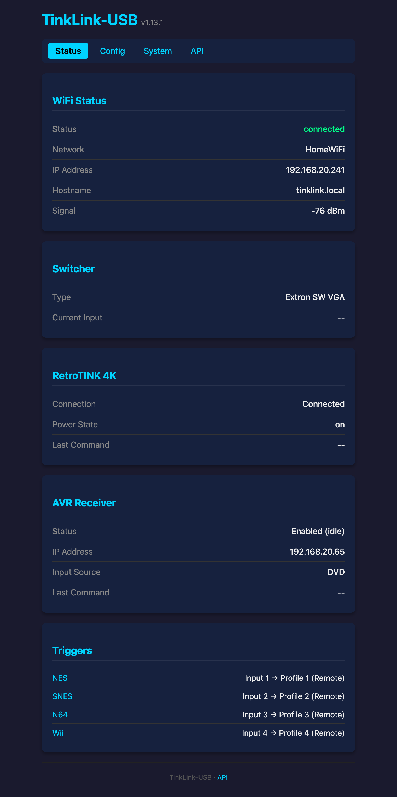

# TinkLink-USB

Switch inputs on your video switcher, and your RetroTINK 4K loads the right profile by itself.

TinkLink-USB is a small ESP32-S3 board that listens to your video switcher and tells the RetroTINK 4K which profile to load, over a single USB cable. It can also turn on your Denon/Marantz receiver and select its input, and it lets the [RT4K Profiler](https://rt4k-profiler.pipe.hr) and Remote web apps reach the RetroTINK over WiFi.

<p align="center">
  
  &nbsp;&nbsp;
  
</p>

**Current version: 1.13.1** · [Changelog](docs/changelog.md)

## What it does

- **Automatic profiles** — each switcher input maps to a RetroTINK profile, loaded either like a remote button press or through the RetroTINK's SVS auto-load.
- **Follows your consoles** — with an Extron switcher, powering on a console switches to its input on its own.
- **Wakes the RetroTINK** — if it is asleep when you change input, TinkLink turns it on and loads the profile as soon as it has booted.
- **Receiver control** — optionally powers on a Denon/Marantz receiver and selects its input. Receivers are found on the network automatically.
- **RT4K Profiler and Remote apps over WiFi** — choose *Connect via Retro-Bridge* in the app and enter TinkLink's address. Edit profiles, manage SD card files, even update the RetroTINK's firmware, without moving the USB cable.
- **Web interface** — status, WiFi setup, input-to-profile mappings, receiver settings, a live console, backup and restore. Every setting applies immediately.
- **Updates over WiFi** — no need to unplug anything after the first flash.

## What you need

- ESP32-S3 board (the [Waveshare ESP32-S3-Zero](https://www.waveshare.com/wiki/ESP32-S3-Zero) is recommended)
- USB OTG adapter with power input, and a cable to the RetroTINK 4K's USB-C port
- RS-232 level shifter (MAX3232 module) and a serial cable for the switcher
- A video switcher with RS-232 (Extron SW series VGA switchers today; more can be added)

Shopping links, wiring and pinout: **[Hardware guide](docs/hardware.md)**. No ESP32-S3? An ESP32-C3 works over the RetroTINK's HD-15 serial pins: **[Alternative boards](docs/alternative-boards.md)**.

## Quick start

1. **Install** [PlatformIO](https://platformio.org/install) and get the code:
   ```bash
   git clone https://github.com/smudgeface/tink-link-usb.git
   cd tink-link-usb
   ```
2. **Flash** the board over USB (firmware, then web pages):
   ```bash
   pio run -e esp32s3 -t upload
   pio run -e esp32s3 -t uploadfs
   ```
3. **Wire it up**: board to the RetroTINK by USB, board to the switcher through the level shifter ([wiring](docs/hardware.md#wiring)).
4. **Join its WiFi**: the LED blinks blue and a network called `TinkLink-XXXXXX` appears (no password). Connect and open `http://tinklink.local` or `http://192.168.1.1`.
5. **Connect it to your network** on the Config page. The LED turns green and TinkLink is at `http://tinklink.local`. (Or skip this and keep using its own network.)
6. **Map inputs to profiles** under Triggers on the Config page. Done.

Later updates go over WiFi: `pio run -t ota -e esp32s3`. Details in **[Building, flashing and updating](docs/building.md)**.

## Web interface

| Page | What it's for |
|------|---------------|
| **Status** | WiFi, switcher input, RetroTINK connection and power, receiver, and your mappings at a glance |
| **Config** | WiFi, input-to-profile mappings, RetroTINK and receiver settings |
| **System** | Live log and console, updates, backup and restore, reboot |
| **API** | REST API reference with try-it buttons |

## Documentation

- [Hardware guide](docs/hardware.md) — parts, boards, wiring, pins
- [Building, flashing and updating](docs/building.md) — USB flash, WiFi updates, logs, project layout
- [Configuration reference](docs/configuration.md) — every setting
- [Alternative boards](docs/alternative-boards.md) — ESP32-C3 and other boards without USB Host
- [Troubleshooting](docs/troubleshooting.md) — LED colours, `.local` problems, flashing problems
- [RetroTINK 4K serial commands](docs/retrotink-serial.md) — what TinkLink sends, and how it tracks power
- [Changelog](docs/changelog.md) — release notes
- [History](docs/history.md) — where the project comes from and why it uses USB

## License and credits

MIT License, see [LICENSE](LICENSE). TinkLink-USB builds on [TinkLink-Lite](https://github.com/smudgeface/tink-link-lite) and the original [tink-link](https://github.com/smudgeface/tink-link); more in [History](docs/history.md).
