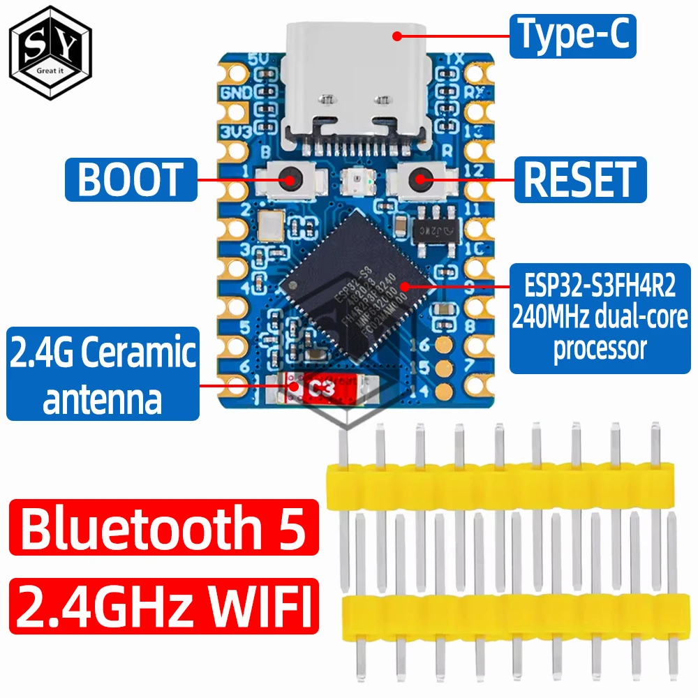
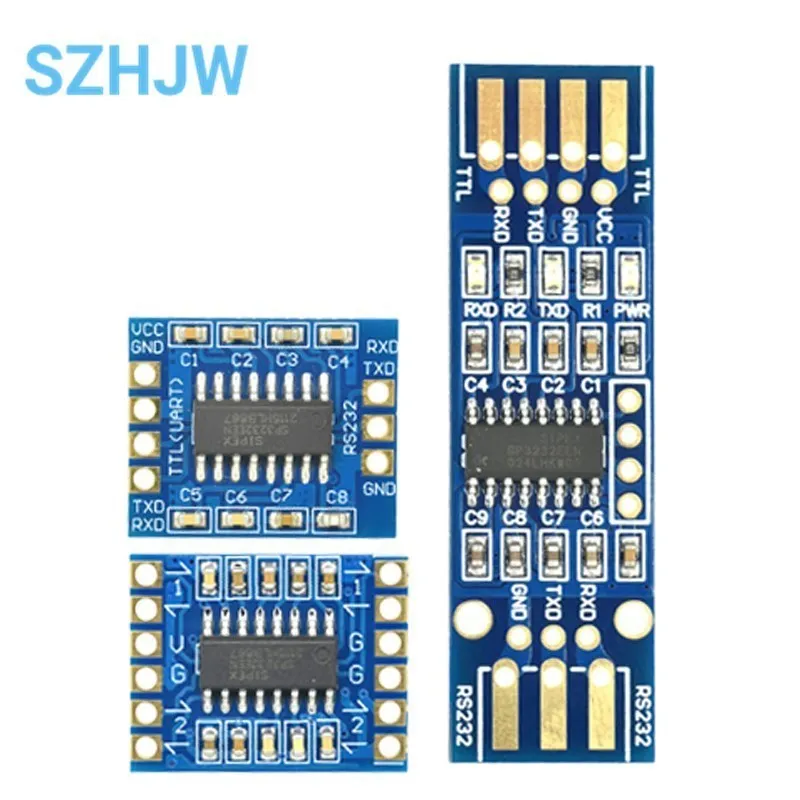
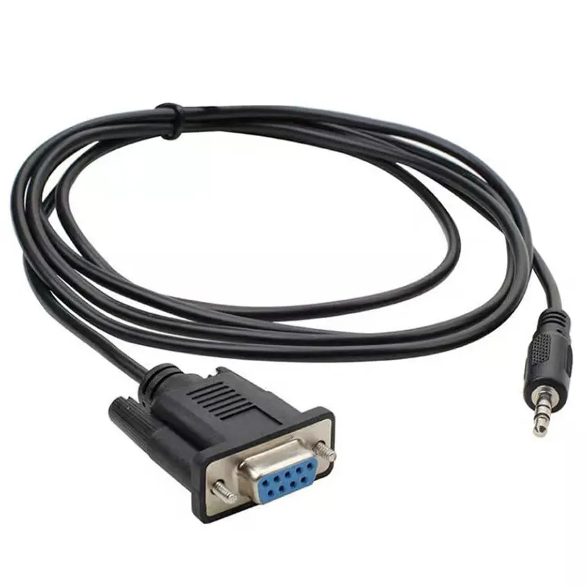

# Hardware

What to buy and how to wire it, for the recommended ESP32-S3 build. For boards without USB Host (ESP32-C3 and others) see [Alternative boards](alternative-boards.md).

## Parts

| Part | Notes |
|------|-------|
| ESP32-S3 board | [Waveshare ESP32-S3-Zero](https://www.aliexpress.com/item/1005006963045909.html) recommended. USB Host needs an ESP32-S3. |
| USB OTG adapter with power input | e.g. [MOGOOD 60W PD USB OTG adapter](https://www.amazon.ca/dp/B0B5MPCJF5), plus a USB-A to USB-C cable to the RetroTINK. Powers the board and connects it to the RetroTINK. |
| RS-232 to TTL module | [MAX3232 module](https://www.aliexpress.com/item/1005006210630153.html). Converts the switcher's RS-232 levels to the board's 3.3 V. |
| Serial cable for the switcher | For Extron: [DB9 to 3.5 mm adapter](https://www.aliexpress.com/item/1005009105067080.html) |
| RetroTINK 4K | Firmware 1.75 or newer recommended. Older firmware works after setting the baud rate to 115,200 on the Config page. |
| Video switcher with RS-232 | Extron SW series VGA switchers are supported today |
| 2.4 GHz WiFi | For the web interface. Optional: TinkLink can also run as its own access point. |

  

## Supported ESP32-S3 boards

Any board supported by the [EspUsbHost](https://github.com/wakwak-koba/EspUsbHost) library should work:

| Board | Notes |
|-------|-------|
| **Waveshare ESP32-S3-Zero** | Recommended. 23.5 × 18 mm, USB-C, onboard RGB LED. [Wiki](https://www.waveshare.com/wiki/ESP32-S3-Zero) · [Pinout](https://www.espboards.dev/esp32/esp32-s3-zero/) · [Schematic](https://files.waveshare.com/wiki/ESP32-S3-Zero/ESP32-S3-Zero-Sch.pdf) |
| ESP32-S3-DevKitC-1 | Standard development board |
| M5Stack ATOMS3 | Compact, built-in display |
| M5Stack StampS3 | Very small module |

## Wiring

**RetroTINK 4K** — USB only. Plug the OTG adapter into the board, power into the adapter, and a cable from the adapter to the RetroTINK's USB-C port.

**Switcher (RS-232)** — through the level shifter:

| ESP32-S3-Zero | MAX3232 module | Switcher |
|---------------|----------------|----------|
| GPIO43 (TX) | TTL in → RS-232 out | RX |
| GPIO44 (RX) | TTL out ← RS-232 in | TX |
| 3V3, GND | VCC, GND | GND |

The Extron link runs at 9600 baud, 8N1.

## Pins used (ESP32-S3-Zero)

| Function | GPIO | Notes |
|----------|------|-------|
| USB D− / D+ | 19 / 20 | Wired to the board's USB-C port |
| Switcher TX | 43 | UART0 |
| Switcher RX | 44 | UART0 |
| Status LED | 21 | Onboard WS2812 RGB LED |

GPIO33–37 are used by the board's PSRAM and aren't available. Pins can be changed in the [configuration](configuration.md).

## The USB port does double duty

The ESP32-S3's single USB port is either a programming/debug port or a USB Host port, not both. TinkLink uses it as a USB Host (`-DARDUINO_USB_MODE=0` in `platformio.ini`), which means:

- no debug output over USB: use the web console or [`scripts/logs.py`](building.md#reading-logs);
- flashing over USB needs [bootloader mode](troubleshooting.md#usb-upload-doesnt-start); after the first flash, [update over WiFi](building.md#updating-over-wifi-ota).

Background: [ESP32-S3 USB OTG documentation](https://docs.espressif.com/projects/esp-idf/en/stable/esp32s3/api-guides/usb-otg-console.html).
